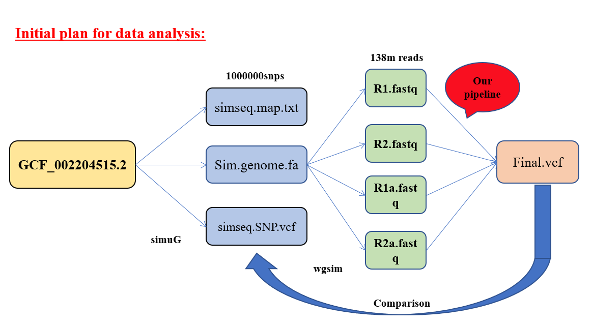

# MosquitoGenomeAnalysis

+ **Basic hands on with Simulated mosquito genome DataSet:**

Initially, I produced some simulated data sets using the RefSeq ID: GCF 002204515.2. 
After that, I worked with the real mosquito gnome raw data sets. There are therefore some simple workflows generated to analyse (Variant calling) the mosquito genome data set.
First, generated a simulated mosquito genome containing 1000000 randum variant inside it.
After that few data sets have been produced from the simulated genome.
Those simula data sets are then used for variant calling analysis.
After that I compaired those produced vcf files with the orginal vcf and calculate the accuracy of selecting the variants. 

+ **Initial plan for Simulated mosquito genome data analysis:**

+ **Problem Statement:**

This is a very interesting Project I have successfully compleated.
We have 5 Aedes aegypti population, Pop1, Pop2, Pop3, Pop4 and Pop5. 
Pop4 & 5 is the product of the cross of pop 1 and Pop 2 & 3.
The aim is to find out if the genome of Pop 4 &5 is same as of pop1 or Pop2 & 3. 

+ **Objectives:**

I will sequence the entire genome of 5 samples from each population (Pop1-5) with 30X coverage and about 25 Aedes aegypti samples in total. 
The generated sequences are mapped with RefSeq ID: GCF_002204515.2. There are 3 chromosomes and 1 mitochondrial genome present in this reference genome.
In addition, I compare genomes at the SNP level and use these data for population genomic analysis, such as principal component analysis, genetic 
differentiation and population structure analysis. I am unable to perform an annotation work for non-human genomes because we do not have the 
infrastructure to do so.

+ **System and the packages used for this analysis:**

The DRAGEN server is used for variant calling. In this DRAGEN server We do not require to write the variant calling pipeline.
We require only to write the basic script for vc provided in the DRAGEN manual.
For genetic differentiation and population structure analysis I have used the software PLINK. 
This software is also used for principal component analysis but the plots are drawn using R softwre. 

